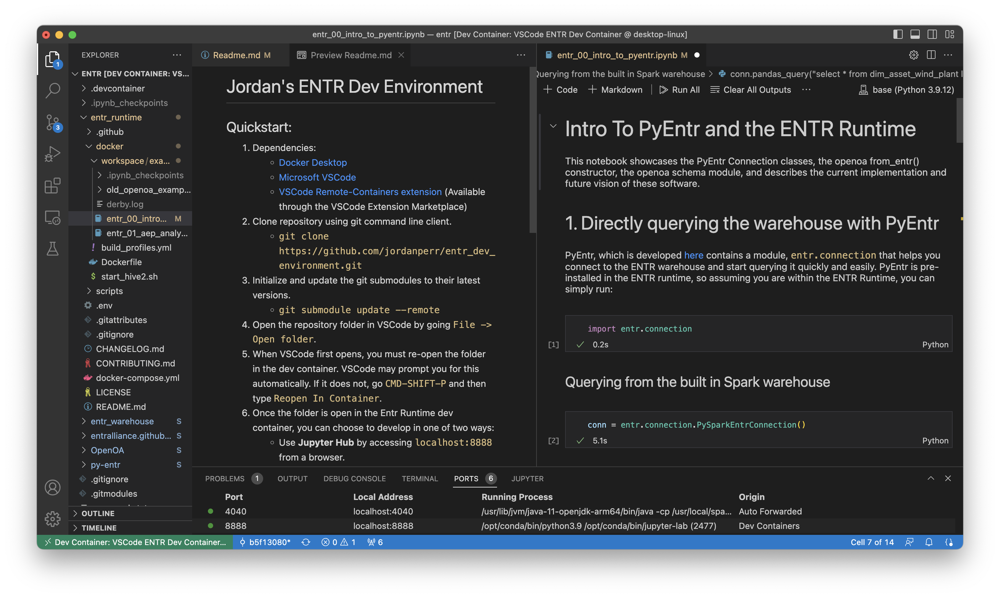

# Jordan's ENTR Dev Environment

## Instructions:

1. Install the dependencies:
    - [Docker Desktop](https://www.docker.com/products/docker-desktop/)
    - [Microsoft VSCode](https://code.visualstudio.com)
    - [VSCode Remote-Containers extension](https://marketplace.visualstudio.com/items?itemName=ms-vscode-remote.remote-containers) (Available through the VSCode Extension Marketplace)
2. Clone repository using git command line client.
    - `git clone https://github.com/jordanperr/entr_dev_environment.git`
3. Initialize and update the git submodules to their latest versions with `git submodule update --remote`
    - *Note: Git will check out each submodule to a speciffic commit hash, in a detached head state. If you want to make commits in given submodule, you'll need to manually checkout a branch in that submodule.*
4. Open the repository folder in VSCode by going `File -> Open folder`.
5. After first opening the folder, you must then re-open the folder in the dev container. VSCode may prompt you for this automatically. If it does not, go `CMD-SHIFT-P` and then type `Reopen In Container`.
    - *Note: You only have to do this once. In the future, VSCode should automatically open the folder using the dev container.*
    - *Note: - You may have to modify `.devcontainer/devcontainer.json` to fit your development needs. For example, you can swap the pre-built entralliance image with your own image, or rebuild it from the Dockerfile.*
6. Once the folder is open in the dev container, you can choose to work in one of two ways:
    - Use **VSCode** to work by simply opening files from the explorer pane, or using the integrated terminal. All of these features will be running inside of the dev container.
        - *Note: You may want to install the [Jupyter Notebooks extensions](https://marketplace.visualstudio.com/items?itemName=ms-toolsai.jupyter) from the VSCode extensions marketplace if you want to edit Python notebooks.*
    - Use **Jupyter Hub** to work by accessing `localhost:8888` from a browser. This server is running in the dev container, and the port has been forwarded to your local machine by VSCode.

